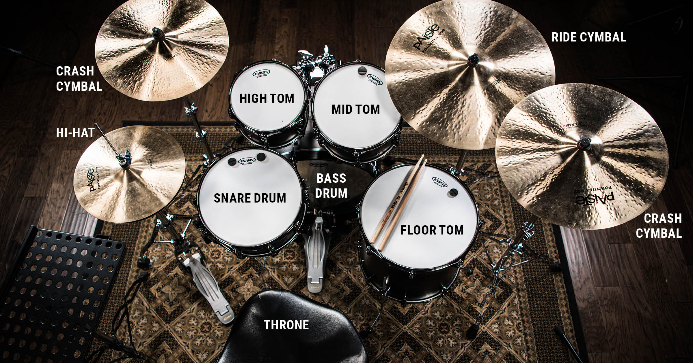

# Drum-Simulator-JS

  **BACKGROUND**:

The Drum Simulator will allow the user to play drum sounds by pressing keys on the keyboard. Each key (only 8 keys) will correspond to a specific drum or cymbal in a standard drumset. The simulator will have the following pieces to be played by keys:
  1) Snare Drum
  2) Hi-Hat
  3) Bass Drum
  4) Floor Tom
  5) High Tom
  6) Medium Tom
  7) Crash Cymbal
  8) Ride Cymbal

  **FUNCTIONALITY & MVPs**:

 With this Drum Simulator, users will be able to:

  - See a tutorial when simulator first loads to walk the user through the functionality. 
  - Press keys on keyboard and play drum/cymbal sounds in a free-style mode.
  - Play an interactive game, in which, the user will need to remember a pattern of drum sounds and play them back in correct order. (Bonus)
  - Record pieces of music they created to listen to them later. (Bonus)
  - Watch a pixelated character playing the drums, corresponding to the keys being played. (Bonus)
  
  In addition, this project will include:
  
   - An ABOUT modal describing how to interact with the simulator.
   - A production README.
   
   **WIREFRAMES**:
   
   
   
   - Nav Links will include links to this project's Github repo, developer's LinkedIn and the About Modal.
   - Other functionality nav bar allows user to play memory game and record pieces of music.
   - Labelled keys on the bottom of screen inform user which piece of drum set it corresponds to.
   
   **TECHNOLOGIES, LIBRARIES,APIs**:
   
   
   **IMPLEMENTED TIMEFRAMES**:

  - **Friday Afternoon & Weekend**: Setup project, including getting webpack started. Reasearch Music/Audio APIs and Canvas on how to implement ideas. Write        code and use Audio API to get sounds of drum/cymabls to correspond to pressing the correct keys on keyboard.

  - **Monday**: Finish up writing code, if needed, for getting keys to make correct sounds. Start styling keys with CSS.

  - **Tuesday**: Start working with Canvas API to get pixelated charavter on screen to correspond to correct keys being played. 

  - **Wednesday**: Finish up code and CSS styling for pixelated character. If time permits start working on memory game/recording features.

  - **Thursday Morning**: Review code and make small updates as needed. Deploy to GitHub pages.

 
  **BONUS FEATURES**:

  - Memory Game: user will try to re-enter random keys in correct order after hearing them once.

  - Recording feature: user will have the option to record any music played in freestyle mode. 
  
